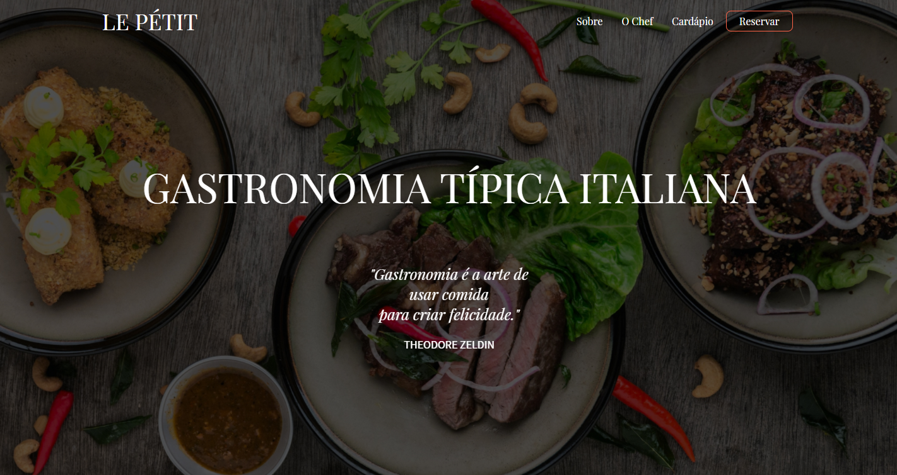

<h1 align="center">
📰 Le Pétit
</h1>

<h4 align="center">
Site fictício desenvolvido como forma de estudo a partir de layout criado por mim.
</h4> 

---

## 📚 Seções
O site é composto por 1 página com 5 seções:

- **Hero**
- **Sobre**
- **O chef**
- **Cardápio**
- **Reservar**

---

## 🛠 Tecnologias utilizadas
Utilizei as seguintes tecnologias durante desenvolvimento:
- HTML5;
- CSS3;
- JavaScript;
